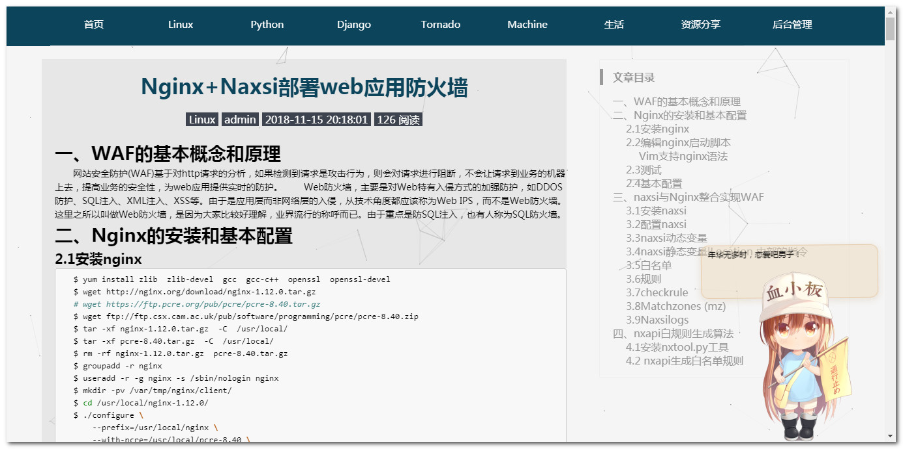
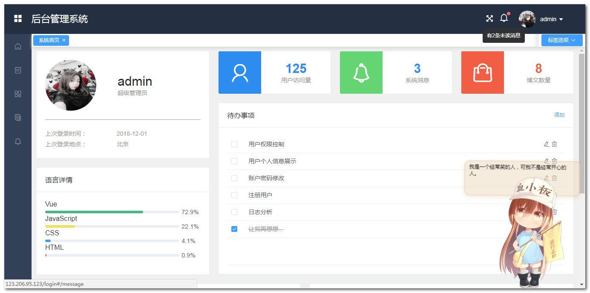
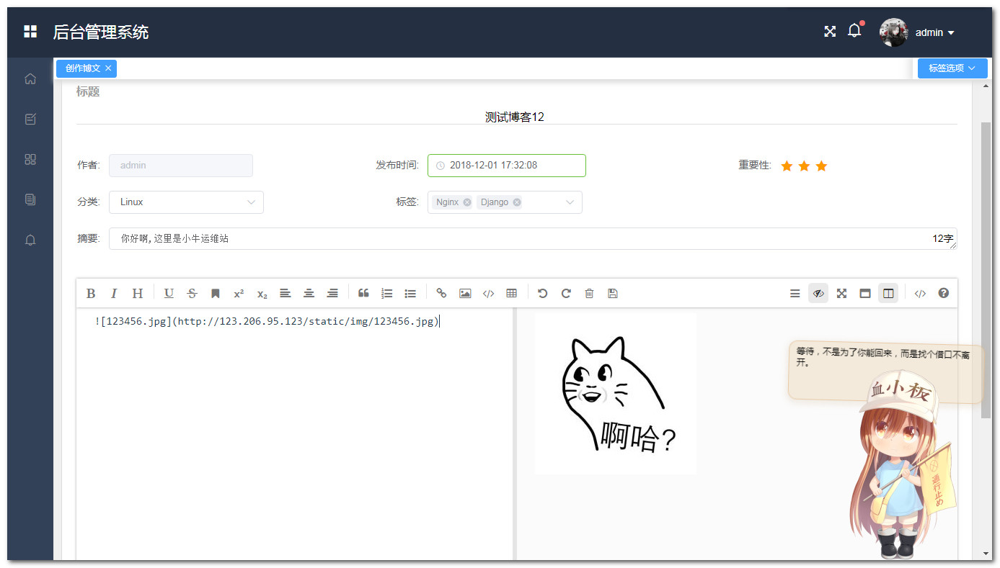
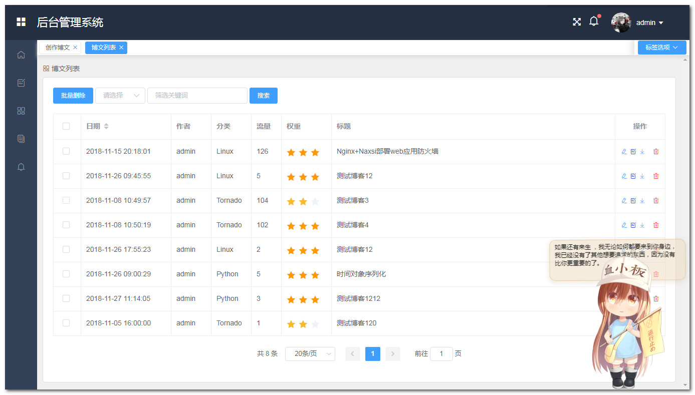

# 个人站点搭建

## 环境
- Vue2.9.6
- Nginx1.10.2
- Python2.7
- Tornado5.1.1
- CentOS6.8

## 前端功能介绍(补充中...)
- [x] 导航条索引
- [x] 搜索条根据博文题目搜索
- [x] 显示最新的几篇文章
- [x] 博文按时间分组展示
- [x] 根据标签搜索博文
- [x] 博文详情展示
- [x] 自动生成博文目录
- [x] 游客访问计数
- [x] 博文访问计数
- [] 待添加

## 后台管理功能介绍(补充中...)
- [x] 创建博文
- [x] 支持markdown语法
- [x] 图片上传与实时展示
- [x] 上传博文文件
- [x] 修改博文
- [x] 博文列表
- [x] 博文搜索
- [x] 分页展示
- [x] 下载博文
- [x] 删除博文
- [x] 系统流量监控
- [x] 系统内存监控
- [x] 系统CPU监控
- [x] 系统负载监控
- [x] 系统通知
- [] 权限控制
- [] 待添加

## 前端页面展示
### 首页

### 博文展示页

## 后台管理页面展示
### 后台首页

### 博文编辑

### 博文列表

### 系统监控

## 感谢
[PanJiaChen](https://github.com/PanJiaChen/vue-element-admin) 

[lin-xin](https://github.com/lin-xin/vue-manage-system)

[猫与向日葵](https://imjad.cn/archives/lab/add-dynamic-poster-girl-with-live2d-to-your-blog-03)
## 尾
