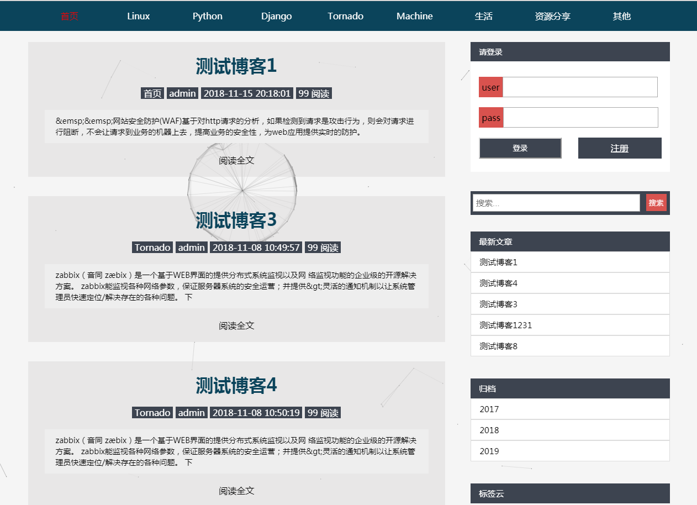
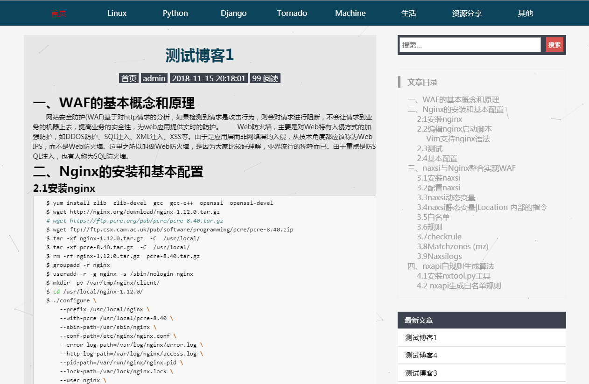
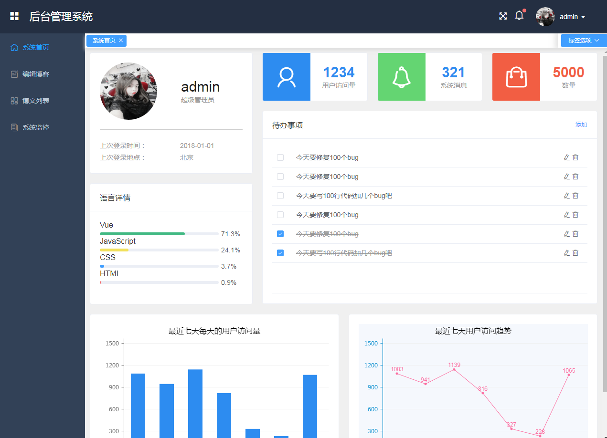
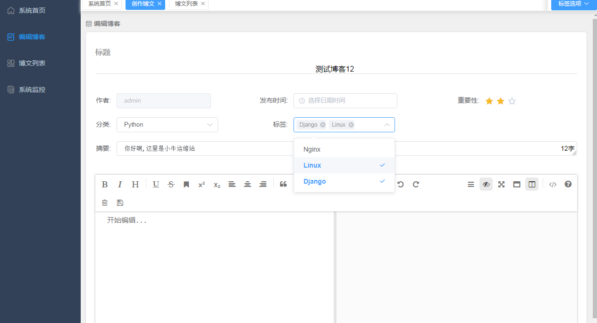
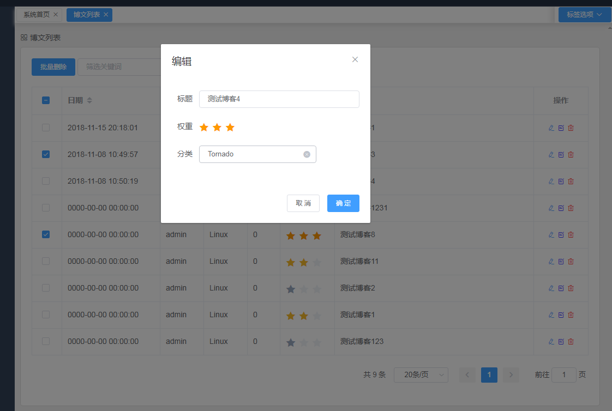
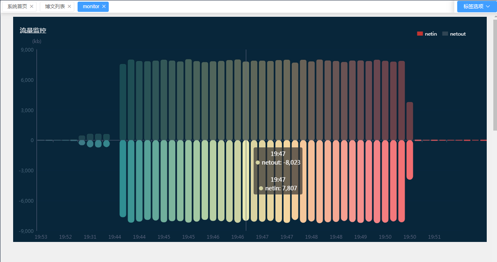
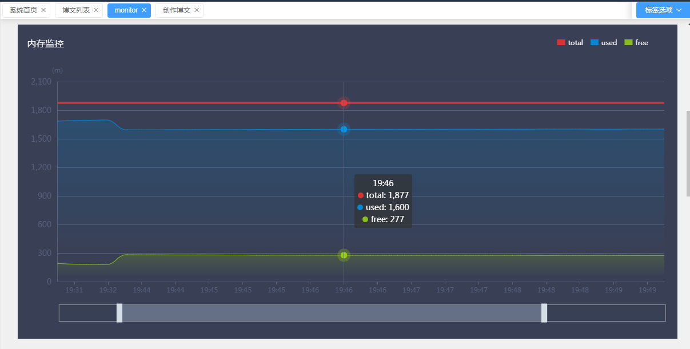
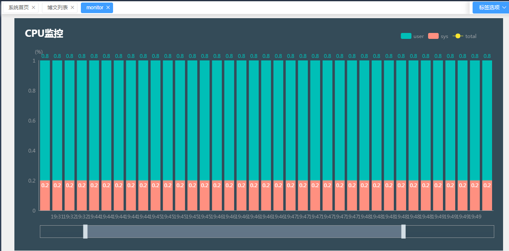
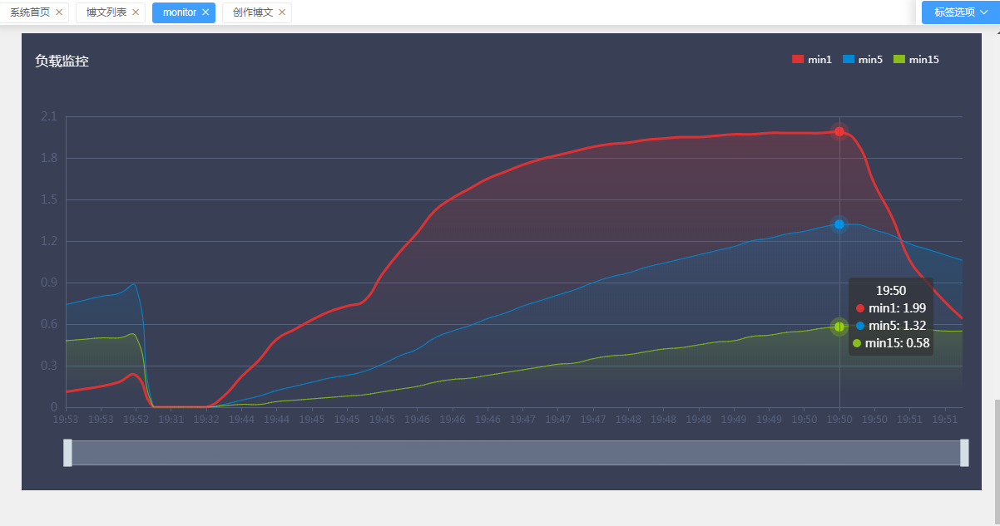

# 个人站点搭建

## 环境
- Vue2.9.6
- Nginx1.10.2
- Python2.7
- Tornado5.1.1
- CentOS6.8

## 前端功能介绍(补充中...)
[x] 导航条索引博文
[] 搜索条根据博文题目搜索
[x] 显示最新的几篇文章
[] 显示访问量最多的几篇博文
[] 博文按时间分组展示
[x] 根据标签搜索博文
[x] 博文详情展示
[x] 自动生成博文目录
[] 待添加

## 后台功能介绍(补充中...)
[x] 修改博文
[x] 添加博文
[x] 支持markdown创建博文
[x] 创建博文
[x] 博文列表
[] 博文搜索
[x] 系统流量监控
[x] 系统内存监控
[x] 系统CPU监控
[x] 系统负载监控
[] 可以上传/下载markdown格式博文
[] 待添加

## 前端页面展示
### 首页

### 博文展示页

## 后台管理页面展示
### 后台首页

### 博文编辑

### 博文列表

### 系统监控

## 感谢
[PanJiaChen](https://github.com/PanJiaChen/vue-element-admin) 
[lin-xin](https://github.com/lin-xin/vue-manage-system)

## 尾
